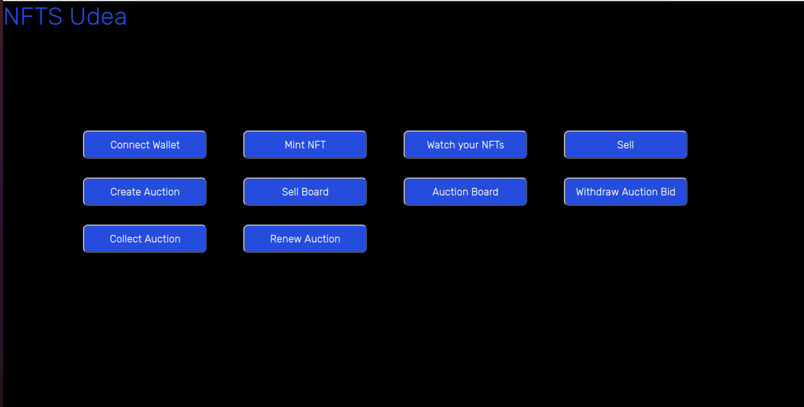
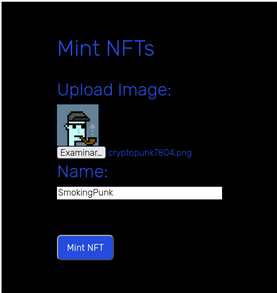
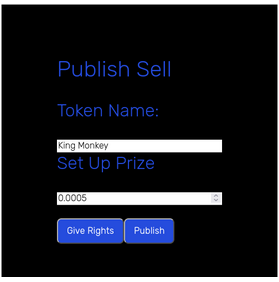
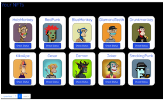
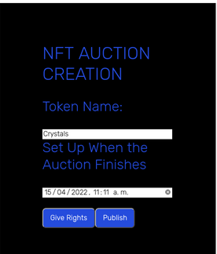

# NFT Market Platform

This project was adapted from [Alchemy's NFT Minter tutorial](https://docs.alchemyapi.io/alchemy/tutorials/nft-minter), so it allows to mint and sell nfts that are stored in Pinata

## Main Menu:

## Mint:

## Sell the NFT:

## Sells Board:

## Create an Auction:

## Auction Board:

You need to configure a network in  Metamask, private network: UdeaNFT, RPC URL: https://eth-ropsten.alchemyapi.io/v2/gKNx6FdPvtTiI-jUkn8JyO3vEknpCqUN, Chain ID: 3, Currency Symbol: ETH and  Block Explorer URL: https://ropsten.etherscan.io

Link to the Platform: https://nft-market-place-udea.herokuapp.com/

This work was done as a learning exercise and it was done on a test-network.
